<h1 align="center"> Battery tester s STM8 </h1>
<p align="center">Dlouhodobá maturitní práce Jiřího Koldy.</p>
<p align="center">(4.B, 2022/23)</p>

---

## Specifikace zařízení
1) Rozměry - 140mm x 100mm x 110mm.
2) Vstupy a výstupy - Napájecí konektor 5.5 x 2.1 mm samice - Šroubovací konektor 2P pro připojení baterie.
3) Napájecí zdroj - 5V alespoň 2A.
4) Komunikace s uživatelem - Display MAX7219, 2x tlačítko 6x6x5mm.
5) Kompatibilní baterie - baterie typu Li-ion a Li-polymer, baterie musí být opatřeny vývody v podobě kabelu, nebo musí být umístěny do příslušného držáku s kabelovým vývodem (platí hlavně pro baterie formátu 18650, 14500, 16340, 26650 a podobné). Zařízení funguje pro baterie, které mají kapacitu od 200mAh do 10Ah.
6) Nabíjecí a vybíjecí proud - zařízení má tři nastavení proudu (100mA, 250mA a 1000mA) 
 	
---	

## Bezpečnostní pokyny 
1) Vždy postupujte podle přiloženého návodu. 
2) Nikdy nenechávejte zapnuté zařízení bez dozoru. 
3) Připojujte pouze kompatibilní baterie. 
4) Zařízení nesmí být pužíváno ve venkovních prostorech. 
5) Nesmí dojít ke zkratu žádného z konektorů zařízení.
6) Zařízení nedisponuje krytím IP. Pokud bylo zařízení poškozeno vodou nesmí být dále používáno.
7) K zařízení nesmí bý připojovány sériově zapojené baterie.
8) Před odpojením zařízení ze sítě vždy odpojte baterii 


---

## Schéma zapojení
<p align="center">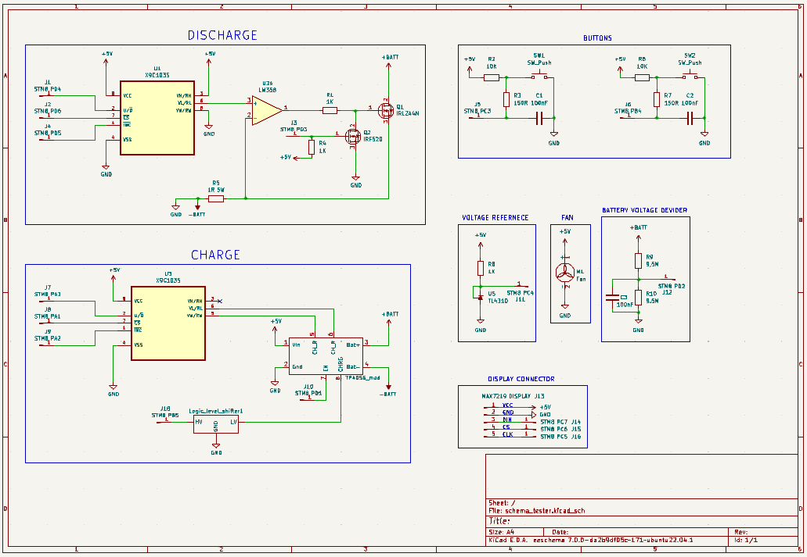<p>
<p>Obr č.1</p>
  
---
  
## STM8S Dero Board Pinout
<p align="center">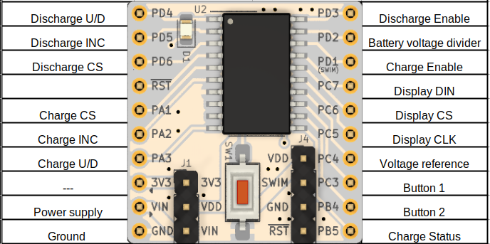<p>
<p>Tab č.1</p>
  
---
  
## Seznam Součástek
<p align="center">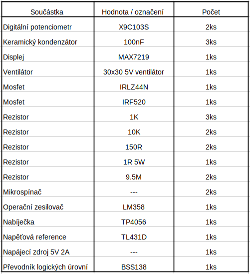<p>
<p>Tab č.2</p>

---
  
### Osazená univerzální deska 

<p align="center">
  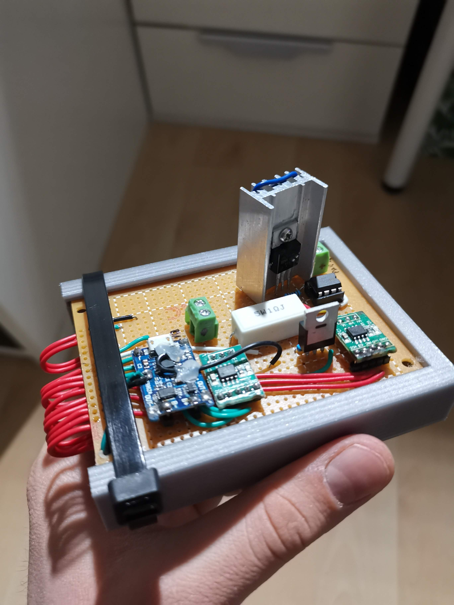
  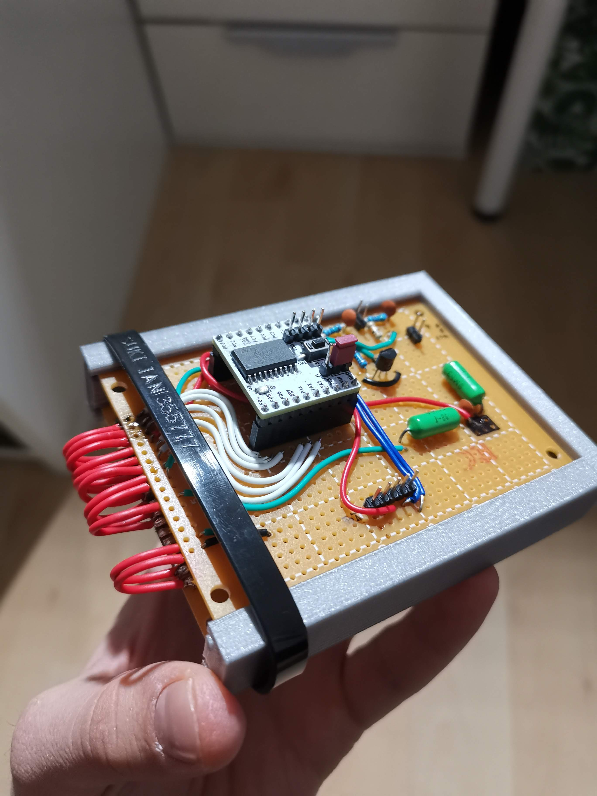 
</p>
<p align="center">Obr č.2, č.3</p>
<p align="center">
  
  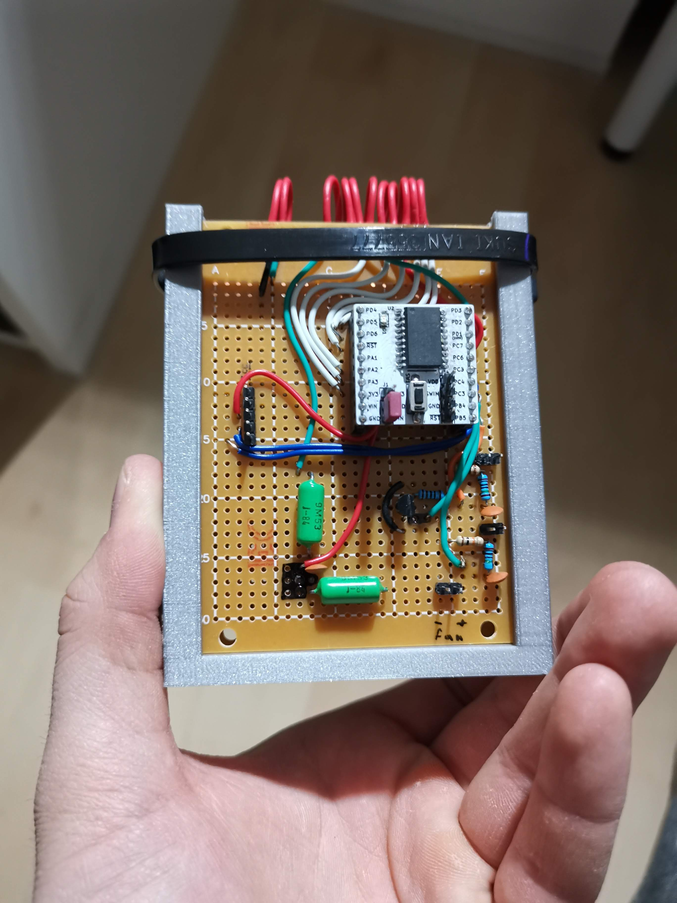 
</p>
<p align="center"> Obr č.4, č.5</p>

---

## Úprava nabíječky TP4056
<p>Tato sekce popisuje úpravy, které byly provedeny na výše zmíněném modulu TP4056.</p>
<p>Je třeba odpájet rezistor R3(Rprog), jeho hodnota nastavuje nabíjecí proud (viz tabulka č.3). Místo něj se pájecí plošky připojí na piny digitálního potenciometru VH a VW. Díky této úpravě můžeme nastavit nabíjecí proud pomocí STM8</p>
<p>Dále se musí odpájet CE(Pin8). Připojení pinu CE na logickou 1 (TTL logika) uvede čip do normální funkce, Díky této modifikaci můžeme nabíječku zapínat a vypínat pomocí výstupu STM8</p>
<p>Poslední úprava na desce je odpájení pinu CHRG(Pin7) a jeho připojení na pin STM8. V případě že se baterie nabíjí je pin CHRG nastaven na logickou 0, v opačném případě je nastaven na logickou 1. Nyní může program reagovat na ukončení nabíjení.</p>


<p align="left">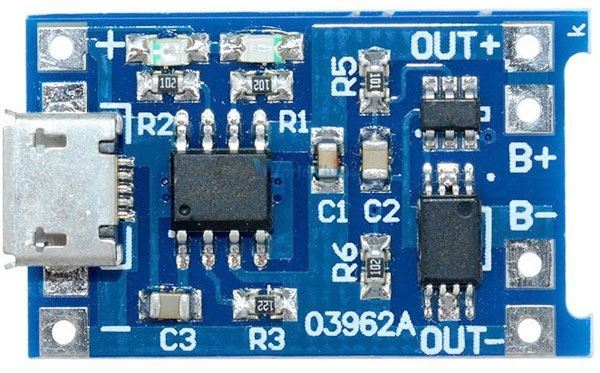<p>
  <p>Obr č.6</p>
<p align="left">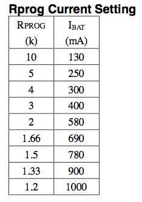<p>
  <p>Tab č.3</p>

---

## Metoda nabíjení CC-CV
<p>Nabíjení lithiových článků probíhá metodou CC-CV. Nejdříve se baterie nabíjí v režimu konstantního proudu (CC - Constant Current), do doby než baterie dosáhne svého horního mezního napětí. V tuto chvíli se nabíječka přepne do režimu konstantního napětí (CV - Constant Voltage) a dojde k omezení nabíjecího proudu. Při dosažení horní meze napětí dojde k nasycení baterie, a proud tím klesá. Příklad nabíjecí charakteristiky pro baterii s kapacitou 1000mAh můžeme vidět na obrázku č.3 </p>
<p align="left">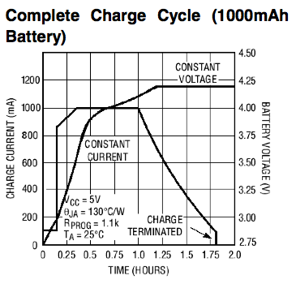<p>
  <p>Obr č.7</p>
  
---

## Metoda vybíjení baterie a výpočtu kapacity 
<p>Vybíjení baterie začne ve chvíli kdy STM8 nastaví svůj výstup PD3 na logickou 0, v tuto chvíli se začne baterie vybíjet předem nastaveným proudem. Vybíjecí proud je konstantní (není závislý na napětí připojené baterie). Mikrokontroler v pravidelných intervalech měří napětí na děliči, které se rovná polovině napětí baterie. Zároveň také počítá uplynulý čas od začátku vybíjení, až po jeho ukončení. Právě díky těmto hodnotám je zařízení schopno vypočítat kapacitu baterie. </p>
<p>Vzorec výpočtu je následující : $Kapacita[Ah] = I[A] * t[h]$

## Závislost kapacity baterie na vybíjecím proudu 
<p> Vztah mezi výstupním proudem a kapacitou baterie není lineární. Místo toho následuje křivku, kde kapacita klesá rychleji při vyšších odběrech a pomaleji při nižších odběrech, jak můžeme vidět na obrázku č.8</p>
<p align="left">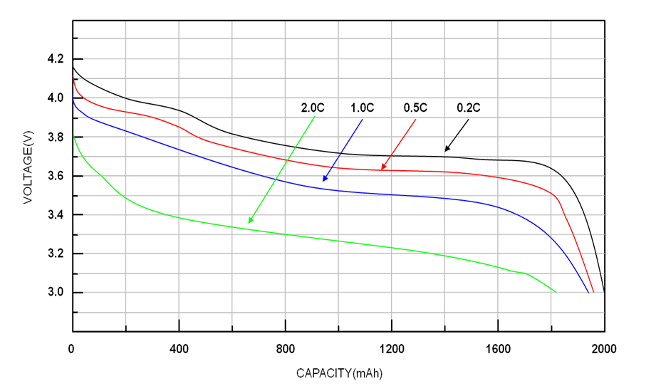<p>
  <p>Obr č.8</p>
  <p> Na obrázku č.8 na první pohled chybí hodnota vybíjecího proudu, místo ní je uvedena hodnota C. C hodnocení se vyjadřuje jako násobek hodnoty kapacity baterie. Například baterie s kapacitou 2000mAh a C hodnocením 1C může bezpečně dodat výstupní proud 2000mA bez poškození nebo přehřátí. Baterie s C hodnocením 2C může bezpečně dodat výstupní proud 4000mA.C hodnocení baterie můžeme najít v jejím datasheetu. C hodnocení je důležitý faktor při výběru baterie pro konkrétní aplikaci. Baterie s vysokým C hodnocením jsou vhodné pro aplikace s vysokým proudem, jako jsou například elektrické nářadí, elektrická vozidla nebo RC letadla. Na druhé straně jsou baterie s nízkým C hodnocením vhodnější pro aplikace s nízkým proudem, jako jsou dálkové ovladače, svítilny nebo malé elektronické zařízení.

---

## Vývojový diagram 

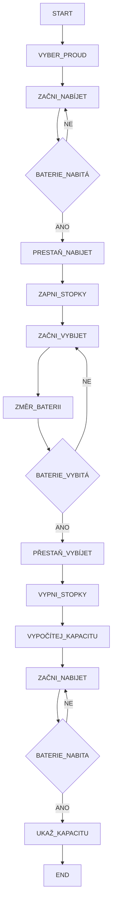
---


## Program
#### Ovládání digitálních potenciometrů 
Zařízení používá digitální potenciometry pro nastavení nabíjecího a vybíjecího proudu baterie. Změna odporu potenciometru probíhá skokově, a to ve sto krocích. Ke změně o jeden krok slouží funkce ```discharge_up_resistance && discharge_down_resistance``` (stejná dvojice funkcí existuje i pro nabíjecí část obvodu). Posun o jeden krkok uskutečníme kombinací logických 1 a 0 podle tabulky č.4

```c 
void discharge_up_resistance(void)
{
	GPIO_WriteHigh(discharge_up_down_port, discharge_up_down_pin);
	GPIO_WriteLow(discharge_increment_port, discharge_increment_pin);
	_delay_us(100);
	GPIO_WriteHigh(discharge_increment_port, discharge_increment_pin);
}
```


```c 
void discharge_down_resistance(void)
{
	GPIO_WriteLow(discharge_up_down_port, discharge_up_down_pin);
	GPIO_WriteLow(discharge_increment_port, discharge_increment_pin);
	_delay_us(100);
	GPIO_WriteHigh(discharge_increment_port, discharge_increment_pin);
} 
```
<p align="center">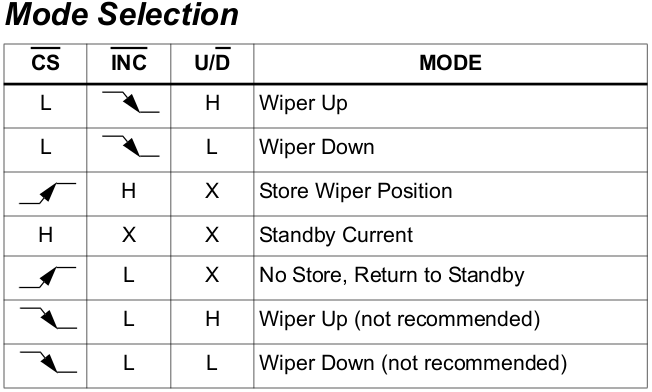<p>
<p>Tab č.4</p>


Následující část programu "vynuluje" potenciometr a nastaví požadovaný odpor. Proměnná ```d``` reprezentuje počet kroků o které se má odpor snížit z maxima

```c
void discharge_setup(void)
{
    while (discharge_counter < 100)
    {
        discharge_up_resistance();
        discharge_counter++;
    } 
    discharge_counter = 0;     
    while (discharge_counter < d) 
    {
        discharge_down_resistance();
        discharge_counter++;
    } 
}
```

---


## Krabička
<p>Krabička byla vytvořena v programu Onshape a vytištěna na 3D tiskárně, Model lze vytisknout bez použití podpěr a skládá se ze čtyř částí.  </p>
<p align="center">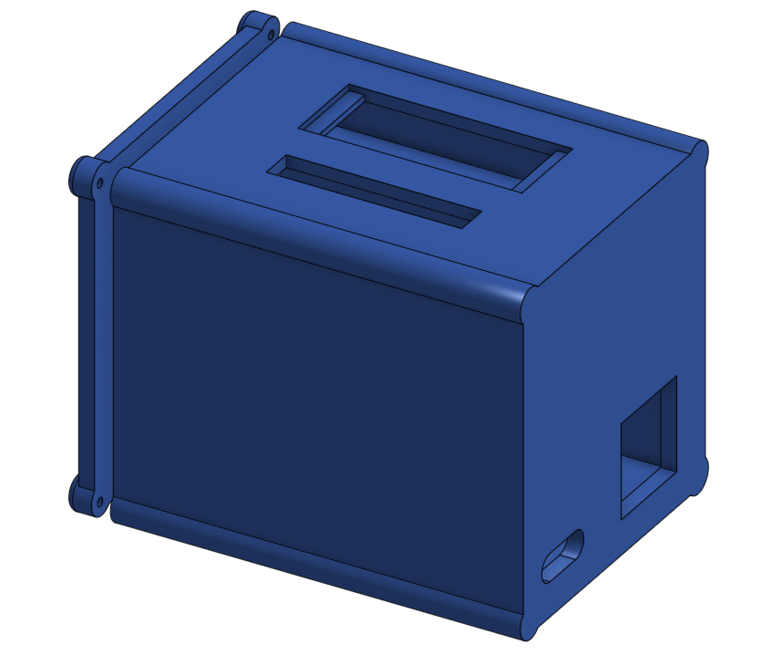<p>
<p>Obr č.9</p>


## Porovnání s testerem baterií liitokala lii-500
<p align="center">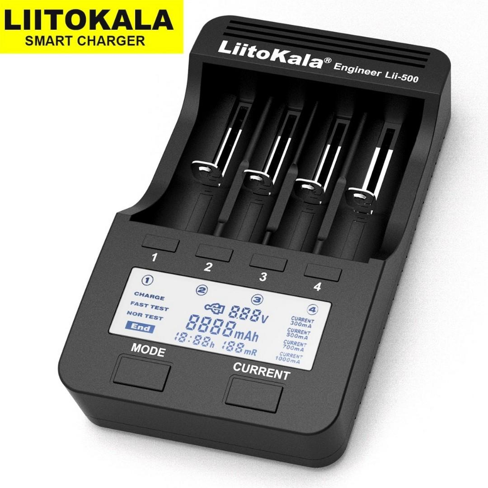<p>
<p>Obr č.10</p>

<p>Podmínky testu - oba testery budou měřit stejnou baterii. Liitokala bude měřit v režimu "Normal Test", který funguje na stejném principu jako moje zařízení. 
