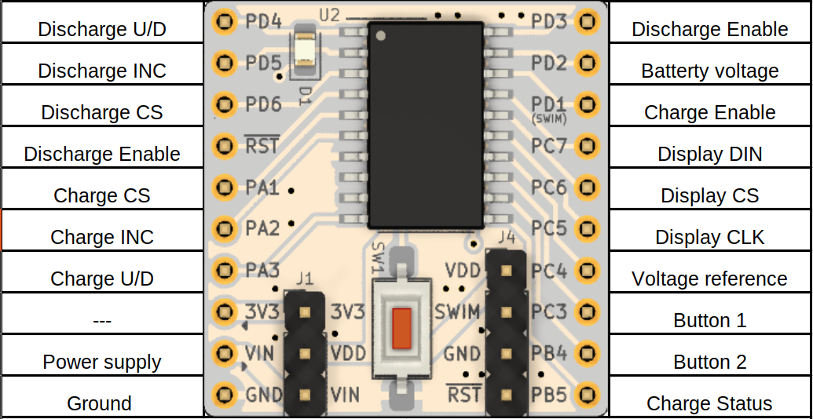

# stm8_battery_tester
## Schéma zapojení

  
---
  
## Pinout

  #### Discharge
  
PD4 = U/D

  
PD5 = INC

  
PD6 = CS

  
PD3 = Enable

  
  #### Charge
  
PA3 = U/D

  
PA2 = INC

  
PA1 = CS

  
PD1 = Enable

  
PB5 = CHRG

  
  #### Buttons
  
PC3 = button1

  
PB4 = button2

  
  #### ADC 
  
PC4 = voltage refernece

  
PD2 = battery

  
  #### Display
  
PC7 = DIN

  
PC6 = CS

  
PC5 = CLK

  
  ---
  
