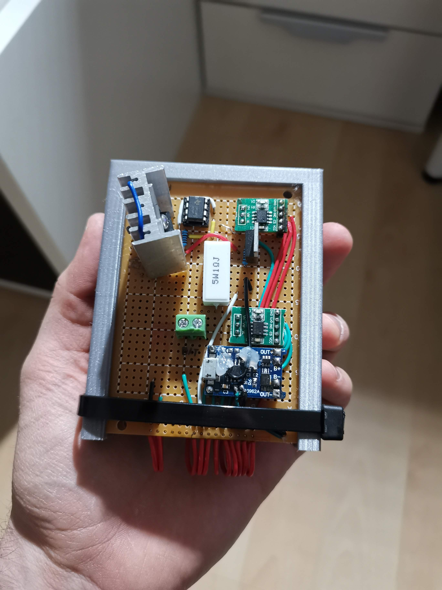

<h1 align="center"> Battery tester s STM8 </h1>
<p align="center">Dlouhodobá maturitní práce Jiřího Koldy.</p>
<p align="center">(4.B, 2022/23)</p>

---

## Schéma zapojení
<p align="center"><p>
<p>Obr č.1</p>
  
---
  
## STM8S Dero Board Pinout
<p align="center"><p>
<p>Tab č.1</p>
  
---
  
## Seznam Součástek
<p align="left"><p>
<p>Tab č.2</p>

<div style="page-break-before: always;"></div>


---
  
### Osazená univerzální deska 

<p float="center">
  
   
</p>
<p>Obr č.2, č.3</p>
<p float="center">
  
   
</p>
<p>Obr č.4, č.5</p>

---

## Úprava nabíječky TP4056
<p>Tato sekce popisuje úpravy, které byly provedeny na výše zmíněném modulu TP4056.</p>
<p>Je třeba odpájet rezistor R3(Rprog), jeho hodnota nastavuje nabíjecí proud (viz tabulka č.3). Místo něj se pájecí plošky připojí na piny digitálního potenciometru VH a VW. Díky této úpravě můžeme nastavit nabíjecí proud pomocí STM8</p>
<p>Dále se musí odpájet CE(Pin8). Připojení pinu CE na logickou 1 (TTL logika) uvede čip do normální funkce, Díky této modifikaci můžeme nabíječku zapínat a vypínat pomocí výstupu STM8</p>
<p>Poslední úprava na desce je odpájení pinu CHRG(Pin7) a jeho připojení na pin STM8. V případě že se baterie nabíjí je pin CHRG nastaven na logickou 0, v opačném případě je nastaven na logickou 1. Nyní může program reagovat na ukončení nabíjení.</p>


<p align="left"><p>
  <p>Obr č.6</p>
<p align="left"><p>
  <p>Tab č.3</p>

---

## Metoda nabíjení CC-CV
<p>Nabíjení lithiových článků probíhá metodou CC-CV. Nejdříve se baterie nabíjí v režimu konstantního proudu (CC - Constant Current), do doby než baterie dosáhne svého horního mezního napětí. V tuto chvíli se nabíječka přepne do režimu konstantního napětí (CV - Constant Voltage) a dojde k omezení nabíjecího proudu. Při dosažení horní meze napětí dojde k nasycení baterie, a proud tím klesá. Příklad nabíjecí charakteristiky pro baterii s kapacitou 1000mAh můžeme vidět na obrázku č.3 </p>
<p align="left"><p>
  <p>Obr č.7</p>
  
---

## Metoda vybíjení baterie a výpočtu kapacity 
<p>Vybíjení baterie začne ve chvíli kdy STM8 nastaví svůj výstup PD3 na logickou 0, v tuto chvíli se začne baterie vybíjet předem nastaveným proudem. Vybíjecí proud je konstantní (není závislý na napětí připojené baterie). Mikrokontroler v pravidelných intervalech měří napětí na děliči, které se rovná polovině napětí baterie. Zároveň také počítá uplynulý čas od začátku vybíjení, až po jeho ukončení. Právě díky těmto hodnotám je zařízení schopno vypočítat kapacitu baterie. </p>
<p>Vzorec výpočtu je následující : $Kapacita[Ah] = I[A] * t[h]$

## Program
#### Ovládání digitálních potenciometrů 
Zařízení používá digitální potenciometry pro nastavení nabíjecího a vybíjecího proudu baterie. Změna odporu potenciometru probíhá skokově, a to ve sto krocích. Ke změně o jeden krok slouží funkce ```discharge_up_resistance && discharge_down_resistance``` (stejná dvojice funkcí existuje i pro nabíjecí část obvodu). Posun o jeden krkok uskutečníme kombinací logických 1 a 0 podle tabulky č.4

```c 
void discharge_up_resistance(void)
{
	GPIO_WriteHigh(discharge_up_down_port, discharge_up_down_pin);
	GPIO_WriteLow(discharge_increment_port, discharge_increment_pin);
	_delay_us(100);
	GPIO_WriteHigh(discharge_increment_port, discharge_increment_pin);
}
```


```c 
void discharge_down_resistance(void)
{
	GPIO_WriteLow(discharge_up_down_port, discharge_up_down_pin);
	GPIO_WriteLow(discharge_increment_port, discharge_increment_pin);
	_delay_us(100);
	GPIO_WriteHigh(discharge_increment_port, discharge_increment_pin);
} 
```
<p align="center"><p>
<p>Tab č.4</p>


Následující část programu "vynuluje" potenciometr a nastaví požadovaný odpor. Proměnná ```d``` reprezentuje počet kroků o které se má odpor snížit z maxima

```c
void discharge_setup(void)
{
    while (discharge_counter < 100)
    {
        discharge_up_resistance();
        discharge_counter++;
    } 
    discharge_counter = 0;     
    while (discharge_counter < d) 
    {
        discharge_down_resistance();
        discharge_counter++;
    } 
}
```

---


## Krabička
<p>Krabička byla vytvořena v programu Onshape a vytištěna na 3D tiskárně, Model lze vytisknout bez použití podpěr a skládá se ze čtyř částí.  </p>
<p align="center"><p>
<p>Obr č.8</p>


